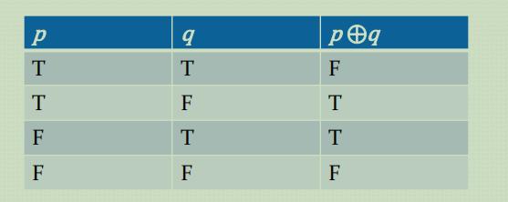
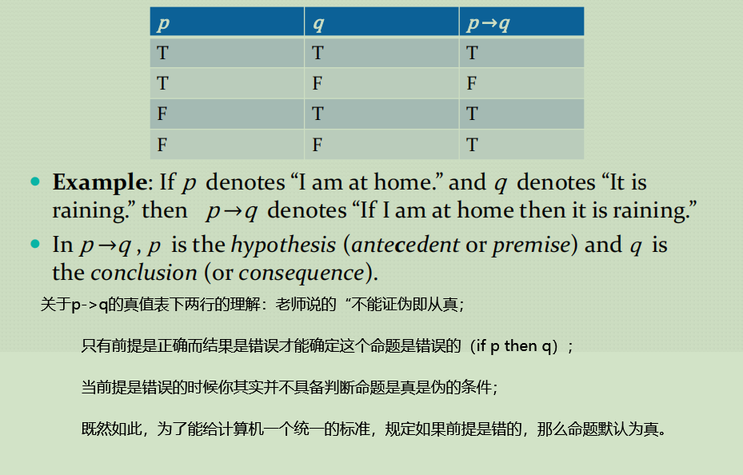
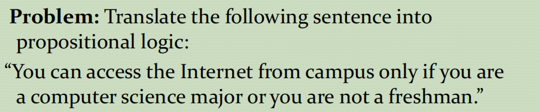

# **Propositionnal Logic**
>PPT的搬运工
## Section Summary
- [Proposition(命题)](#proposition)  
- [Connectives(连接词)](#connectives)
   - Negation
   - Conjunction
   - Disjunction
   - Implication; contrapositive, inverse, converse
   - Biconditional
- [Truth Tables()](#truth-tables)

### Proposition
>Defination
- A proposition is a declarative sentence that is either true or false.(*命题是陈述性的句子，不是真就是假*)
- Examples that are not propositions
  1. Sit down(祈使句，命令的语气)
  2. What time is it?(疑问句)
  3. $x + y = 1$
  4. $x + y = z$(3和4的两种情况可能为真也可能为假无法判断，因此总结为含有未知数的都不是陈述句)
  
### Connectives
>Propositional Logic
- Negation(相当于计算机的取反)

- Conjunction(相当于计算机的and操作)

- Disjunction(相当于计算机的or操作)

我们平时说的Disjunction都是`Inclusive or`， 然而还有一种叫`Exclusive Or`(计算机按位操作的异或)

- Implication(蕴含连接词，大白话说就是左边能不能推出右边)

  - Different Ways of Expressing p->q  
  
  - Converse(逆命题), Contrapositive(逆否命题),Inverse(否命题)高中知识：`原命题与逆否命题等价`
  - 
- Biconditional(双向推导)
  -  
  -  一般来说用 `p is necessary and sufficient for q` or `if p then q , and conversely` or `p iff q`来表达。
- Precedence of Logical Operators(运算符优先级)
  |Operator|Precedence|
  |---     |---       |
  |$\lnot$ |1         |  
  |$\land$ |2         |
  |$\lor$ |3         |
  |$\to$ |4         |
  |$\leftrightarrow$ |5         |

### Truth Tables

- 真值表的构建
  - 行数等于$2^n$(n为变量的个数), 列数就是$n$(n为变量个数+操作符数)
  - 下面给出$p \lor q \to \lnot r$ 的真值表的例子(不截图好烦)  
  
    | p   | q   |r  |$\lnot r$|$p \lor q$|$p \lor q \to \lnot r$|
    | --- | --- |---|---------|----------|---|
    | T   | T       |T|F|T|F|
    | T   | T        |F|T|T|T|
    |T|F|T|F|T|F|
    |T|F|F|T|T|T|
    |F|T|T|F|T|F|
    |F|T|F|T|T|T|
    |F|F|T|F|F|T|
    |F|F|F|T|F|T|
- Taable for Bit Operatiers
   - tips: 位运算中的TF用01来表示

最后Grace顺便提及了一下命题逻辑的应用
- Translating English to Propositional Logic
  - Indentify atomic propositions and represent using propositional variables(先找出原子命题并用变量表示)
  - Determine appropriate logical connectives(确定恰当的逻辑连接词：这里就要熟练记住上文中提到的不同连接词的一般用英语的表达方式)
  - 以下给出一个例子

- 最后给出一道题作为结束(tips：`only if`是上文的"$\to$"的表达)

