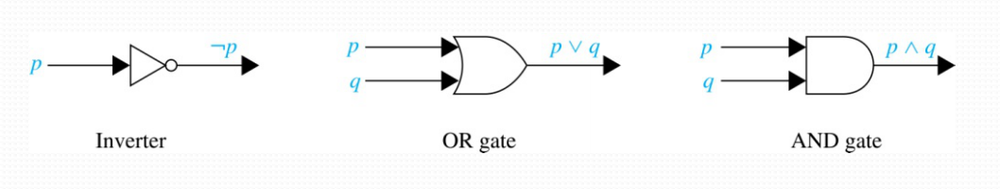
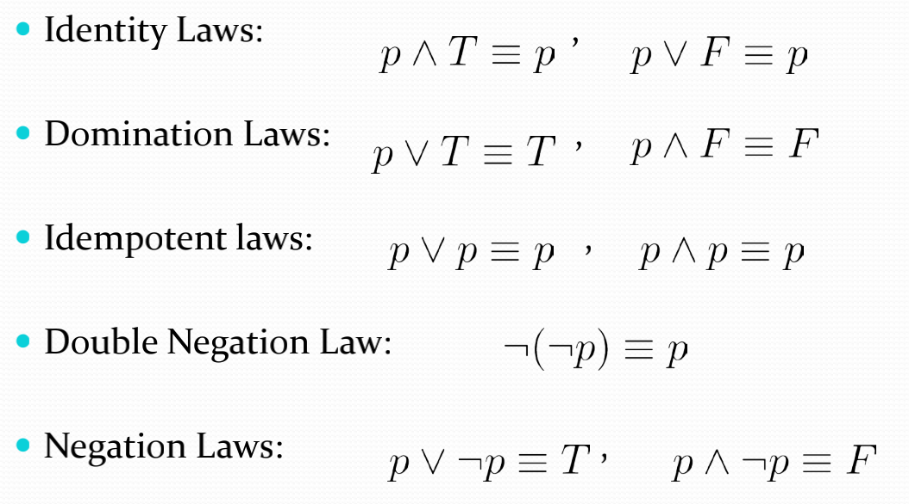
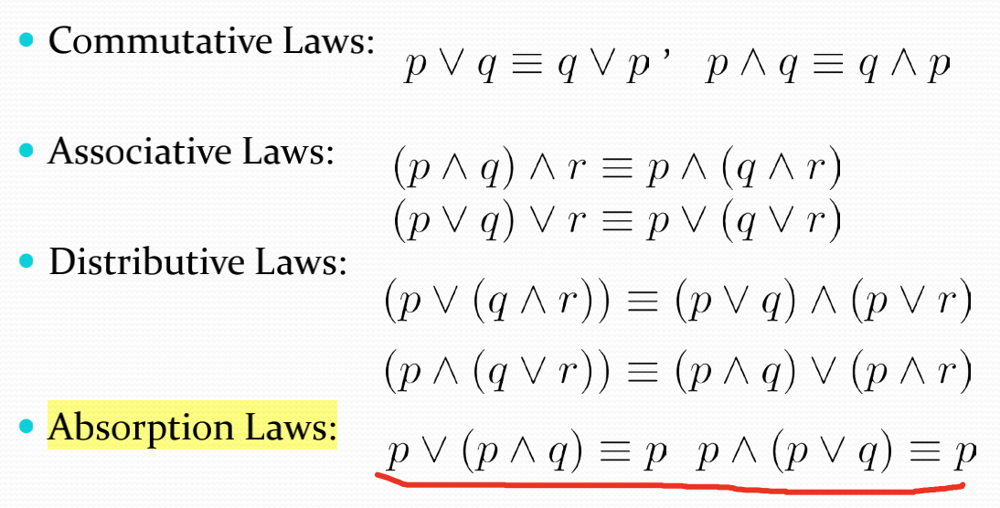
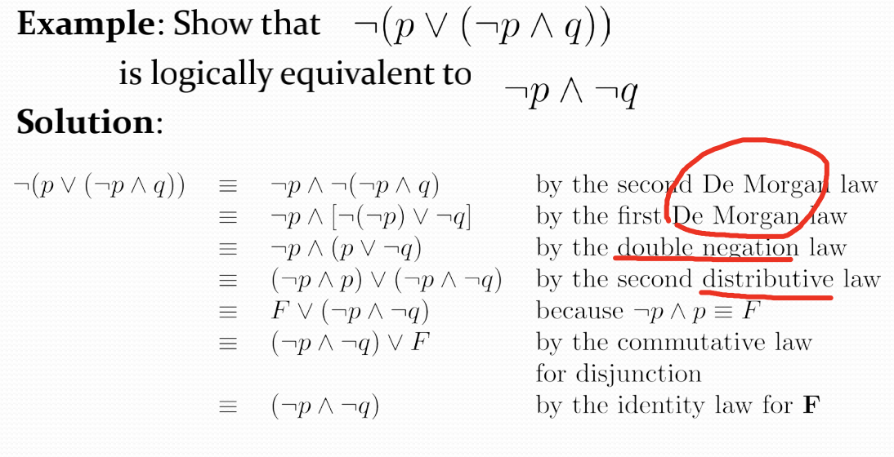

# Propotional Logic(cont) & Predicates and Quantifiers
## Section Summary
- [Propotional Logic(cont) & Predicates and Quantifiers](#propotional-logiccont--predicates-and-quantifiers)
  - [Section Summary](#section-summary)
    - [Application of Propositional Logic](#application-of-propositional-logic)
  - [Propositional Equivalences](#propositional-equivalences)
  - [Predicates and Quantifiers](#predicates-and-quantifiers)
### Application of Propositional Logic
- Boolean Searches
  | Connective | ,                    |
  | ---------- | -------------------- |
  | AND        | 匹配两个都包含的     |
  | OR         | 匹配包含一个以上的   |
  | NOT        | 排除一个特定的搜索词 |
    
    >举个例子 比如我想搜索universities in New Mexico 就可以用 NEW `AND` MEXICO `AND `UNIVERSITIES，另外我想搜索apple banana salad 如果我仅仅想要apple 或者 banana 的口味，就可以用APPLE `OR` BANANA, 另外如果我特别讨厌榴莲味的 我们可以用`NOT` DURIAN。
- Logic Circuits
  
  以上是三种普通的逻辑门，我们需要将其与之前学过的命题相联系。例如：
  
  注意我们只需要按照运算符的优先级顺序来绘制电路图即可。
  ## Propositional Equivalences
  - Tautologies(永真的命题), Contradictions(永假的命题), Contingencies(一般的命题)
  - Logically Equivalent  
  如果 p $\leftrightarrow$ q为永真式即记做 p $\equiv$ q.
  - De Morgan's Laws  
  $\lnot(p \land q) \equiv \lnot p \lor \lnot q$  
  $\lnot(p \lor q) \equiv \lnot p \land \lnot q$  
  Many Other Laws  
  
  
    
  关键在于记住一般的公式并能用真值表来证明
  - Equivalence Proofs
      

## Predicates and Quantifiers
- Predicates(谓词)  
  一般来说 `谓词`可以看作我们编程的`函数`，而函数拥有一个参数我们就叫`一元谓词`，两个参数就叫`二元谓词`，以此类推。同理，在自然语言中，谓词往往也是充当谓语比如"x is greater than 3"中"is greater than 3"就是谓词成分，x就是Variables(变量)成分.不妨给出一个命题函数的例子。  
  
  Precondition(前置条件)PostCondition(后置条件)  
  所谓前置条件就是表述合法输入的语句，后置条件就是程序运行时输出应该满足的条件  
  
- Quantifiers(量词)  
  量词表达了一种范围的感念,比如’All'、Some'这类词语
  - 两个常见量词  
  *Universal Quantifier* "For all", symbol: $\forall$  
  *Existential Quantifier* "some" symbol: $\exist$  
  
    | Statement        | When True                                 | When false                               |
    | ---------------- | ----------------------------------------- | ---------------------------------------- |
    | $\forall x P(x)$ | $P(x)$ is true for every x                | There is an x for which $P(x)$ is false. |
    | $\exist x P(x)$  | There is an $x$ for which $P(x)$ is true. | $P(x)$ is false for every $x$.           |  
    
    An element for which P(x) is false is called a `counterexample`(反例) of ∀xP(x).  
    - Exeample  

