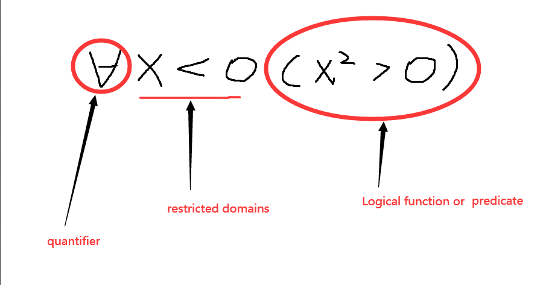

# Quantifier(cont) & Logical Programming & Set 
>写在前面：
    我觉得还是不照着ppt截图比较好，这样才能写出质量较高的note(花费的时间也更多。。。)，另外文中使用的英文都是一些我觉得的考点(用英文是方便记忆)，毕竟考试是英文考试
### Summary
- Predicates and Quantifiers
    - [Quantifiers](##-Quantifiers)
    - [Negating Quantifiers](##-Negating-Quantifiers)
    - [Logic Programming](##-Logic-Programming)
- Set
  - [Definition of sets](##-Definition-of-sets)
  - [Describing Sets](##-Describing-a-Set)
    - Roster Method
    - Set-Builder Notation
  - [Some Important Sets in Mathematics](##-Some-Important-Sets-in-Mathematics)

## Quantifiers
 - Quantifier with Restricted Domains  
    | Statement                | states                                                               |
    | ------------------------ | -------------------------------------------------------------------- |
    | $\forall x < 0(x^2 > 0)$ | that for every real number $x$ with $x < 0$, $x^2 > 0$               |
    | $\forall y = 0(y^3 = 0)$ | for every real number $y$ with $y$ = 0, we have $y^3 = 0$            |
    | $\exist z > 0(z^2 = 2)$  | that there exists a real number $z$ with $z > 0$ such that $z^2 = 2$ |

    下面通过画图具体解释这个`Restricted Domains`
    
    对于Quantifiers的$\forall x P(x)$和$\exist xP(x)$的思考是我们能够用*for*循坏来表达。下面以代码的形式解释,result存储的就是$\forall x P(x)$或$\exist xP(x)$的结果
    ```
    bool result;
    //对任意的x的p(x)
    for (x : U) {
        if (!P(x)) {
            result = false;
            break;
        }
    }
    //对存在的x的p(x)
    for (x : U) {
        if (P(x)) {
            result = true;
            break;
        }
    }
    ```  
    由上述的情况不难看出，结果取决于命题函数和定义域U。
- Precedence of Quantifiers & Binding variables & Equivalence in Predicate Logic
  1. 这些量词的优先级是高于所有之前学的所有逻辑运算符的
  2. 关于Binding variables的两个关键概念是`bound`和`scope`，`bound`就是说当变量被量词修饰的时候就发生了`bound`,而`scope`就是量词的作用域。看下面的一个例子。  
   $\forall x(T(x) \lor G(x)) \land \exist xM(x)$  
   这个表达式中不难看出所有的`variables`都被`bound`而且第一个$\forall $的`scope`为$T(x) \lor G(x)$，同理第二个$\exist$的`scope`为$M(x)$。
  3. 谓词逻辑的等价其实和之前的等价区别不大，使用$\equiv$表示。

## Negating Quantifiers

- De Morgan's Laws for Quantifiers
  $\lnot \forall xP(x) \equiv \exist x \lnot P(x)$  
  $\lnot \exist xP(x) \equiv \forall x\lnot P(x)$  
  不妨想象一个例子，"Everyone will die"就是一个$\forall x P(x)$，`negating`(否定)这句话就是"It is not the case that everyone will die"(使用这个"It is not the case ..."十分方便，直接就表达否定含义了)，这句话和"There is a man who won't die"等价，用逻辑表示为$\lnot \forall x P(x)$ and $\exist x \lnot P(x)$等价。同理我们可以对第二个等式进行这样的理解，文中就不啰嗦了。
  - other
    - Quantifiers as Conjunctions and Disjunctions
    对于`domain`为有限的情况，我们可以用$\land$来表达$\forall$, $\lor$表达$\exist$
    > 例如U(U表示的就是定义域domain)由1、2、3组成 
    $\forall P(x) \equiv P(1) \land P(2) \land P(3)$
    $\exist xP(x) \equiv P(1) \lor P(2) \lor P(3)$
    - Translation from English to Logic
    翻译这样一句话"Some people in chong qin like to eat 辣椒"  
    **Solution**: Let $M(x)$ `denote`(表示)"x like to eat 辣椒" and $S(x)$`denote`"x likes to eat 辣椒", and *U*就是"All people"  
    结果就是 $\exist x (S(x) \land M(x))$  
## Logic Programming
这里从考点上来说我觉得并不怎么重要，主要是Grace介绍了一种逻辑编程语言Prolog，她说我们大三的的那门程序语言原理就是讲这个东西。我这里就直接贴上一个大佬翻译的[learnprolog](https://www.cnblogs.com/seaman-h-zhang/category/703433.html)链接就结束了。

# Set
## Definition of sets
>A set is an unordered collection of objects  
a属于A 记做 $a \in A$  
a不属于A 记做 $a \notin A$

重点在于理解这个set里面包含的`element`的个数到底是怎么一回事, 这里的`element`的个数就是指不重复的元素,注意：`{a}`和`a`应当是两个元素。

## Describing a Set
- Roster Method(括号表示法)  
$S = \{a,b,c,d\}$ $=$ $\{a,b,d,d,c \}$
Ellipses(省略号)可以用来表示1~99这种$\{1,2,3,........,100\}$
- Set-Builder Notation  
这个意思就跟高中学的集合差不多，
比如*S* = $\{x | x < 10\}$、*O* = $\{x \in Z^+ | Prime(x)\}$
  - Interval Notation  
    `closed interval`(闭区间)  $[a,b]$  
    `open interval`(开区间) $(a,b)$


## Some Important Sets in Mathematics
- important sets

    | Set   | Description                              |
    | ----- | ---------------------------------------- |
    | N     | *natural numbers* = $\{0,1,2,3...\}$     |
    | Z     | *integers* = $\{...,-3,-2,-1,0,1,2...\}$ |
    | $Z^+$ | *positive integers* = $\{1,2,3...\}$     |
    | R     | set of *real numbers*                    |
    | $R^+$ | set of *positive real numbers*           |
    | C     | set of *complex numbers*                 |
    | Q     | set of rational numbers                  |

    - Datatype in Computer Science
    数据类型的概念由集合而来，我们称数据类型是set及其在上的一些operator组成。
    - Universal Set and Empty Set  
    Universal set$: U$  
    emptu set: $\emptyset$   
    需要注意的是$\emptyset$与$\{\emptyset\}$不同，前者是空集，后者是一个含有空集的集合。