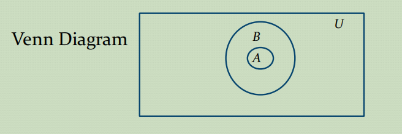
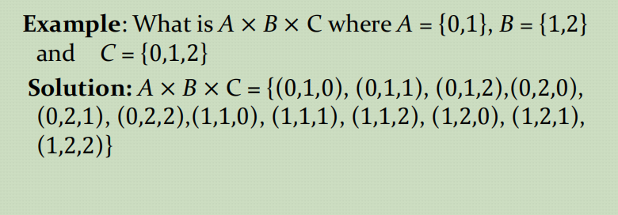
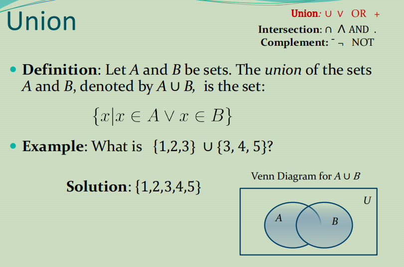
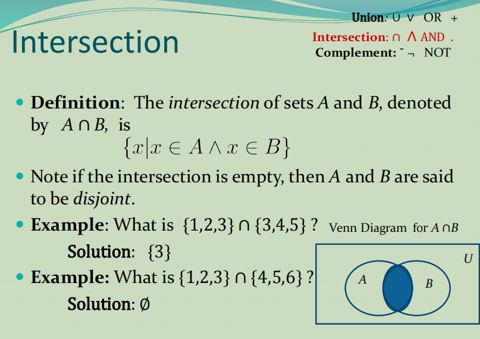
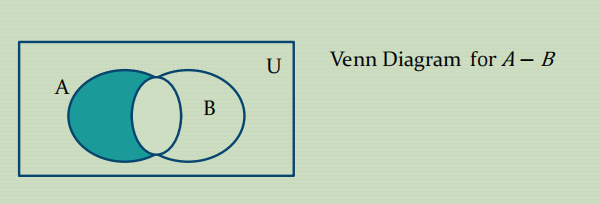
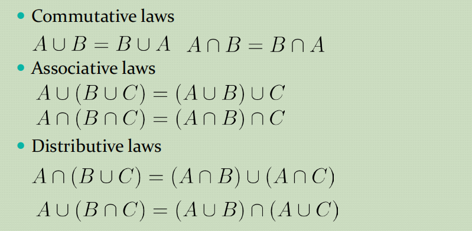

# Set
  - [Set Equality](#set-equality)
  - [Set Cardinality](#set-cardinality)
  - [Cartesian Product](#cartesian-product)
  - [Set Operation](#set-operation)
  - [More on Set Cardinality](#more-on-set-cardinality)
  - [Set Identities](#set-identities)

## Set Equality
两个集合相等当且仅当他们具有相同的元素，用逻辑语言表达就是$\forall x (x \in A \leftrightarrow x \in B)$
- Venn Diagrams
  就是用一个矩形代表全集*U*，在矩形内用圆来表示集合
  
- Subsets
  $A \subseteq B $用逻辑符号表示为$\forall x (x \in A \to x \in B)$这个逻辑表达式值得思考，比如当A为空集的时候,$x \in \emptyset$为假，这时这个逻辑表达式成立，因此空集是任何S集合的子集，同样我们可以得知S集合本身也是他子集的子集
- Another look at Equality of Sets 
A = B iff $\forall (x \in A \leftrightarrow x \in B)$ 
使用逻辑等价替换为$\forall [x \in A \to x \in B) \land(x \in B \to x \in A)]$  
这也就等价于$A \subseteq B$ and $B \subseteq A$

- Proper Subsets(真子集)
  A是B的`proper subset`用逻辑表达就是$\forall x(x\in A \to x \in B) \land \exist x(x \in B \land x \notin A)$

  

## Set Cardinality
The `cardinality`(基数) of 有限集合就是指集合中元素的个数, 通常记作 $|A|$
- Power Sets(幂集)
  A集合的所有子集就是the `power sets` of A，记作$\mathcal{P}(A) $  。一个有n个元素的集合，the `cardinality` of the `power set` is $2^n$  
  需要注意的是空集的幂集即$P(\{\emptyset)\}) =\{\emptyset,\; \{\emptyset \}\}$，这个空集的幂集有两个元素
- Odered n-Tuples
  有序n元组是一个($a_1,a_2,a_3...,a_n$)的一个有序集合，`tuple` 以$a_1$作为第一个元素。。。

  `2-tuple`也叫做`pairs`这个就好像键值对一样。。

## Cartesian Product

>$A \times B = \{(a,b)| a \in A \land b \in B\}$
有多少个集合相乘最终的结果就是几元组

- Truth Sets of Quantifiers
  {$x \in D | P(x)$}前面的D是domain 后面的P(x)就是谓词函数
  最终得到的结果就用集合表示.

## Set Operation
- Union

- Intersection
  
- Complement
  
- Difference(差集)
给出两个集合，集合A和集合B A - B表达的就是在集合A中但不在集合B中的集合

## More on Set Cardinality
- The Cardinality of the Union of Two Sets
  就是说$|A \cup B| = |A| + |B| - |A \cap B|$  
  通俗来讲，就是要排除二者的公共部分.
## Set Identities
- Normal
  
  

    上图中，一个形象的比喻就是在一个纸片上面打了A洞 另一个纸片打了B洞，将纸片合起来把两个纸片中有洞的地方全部捅穿，得到的打穿部分就是结果
  