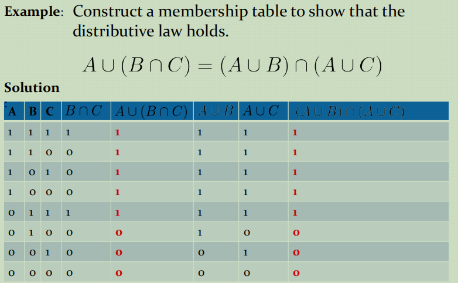
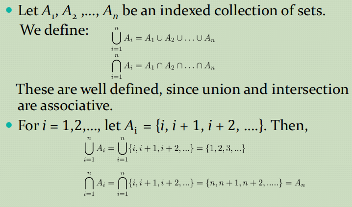
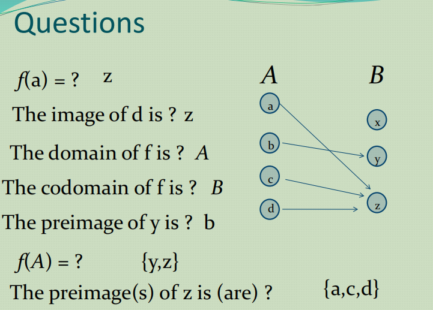
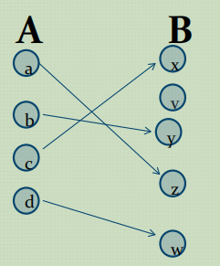
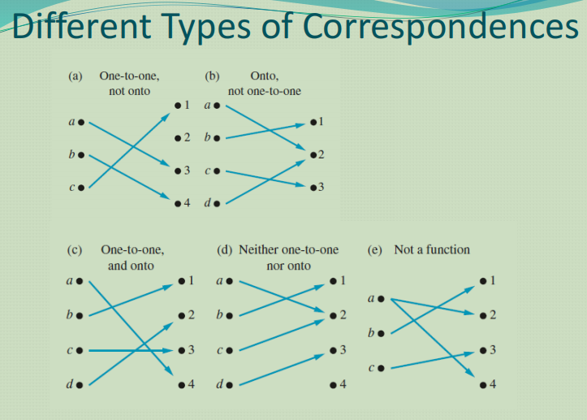
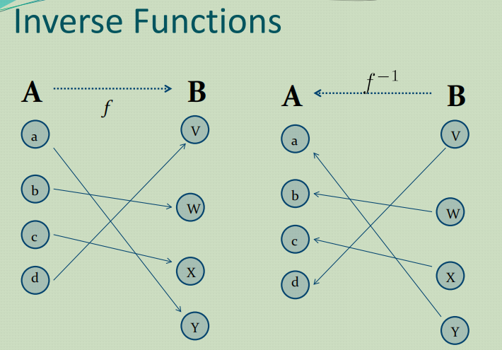

# Sets and Functions

- [Sets and Functions](#sets-and-functions)
    - [Set Cont](#set-cont)
    - [Defination of a Function](#defination-of-a-function)
    - [Injection, Surjection, Bijection](#injection-surjection-bijection)
    - [Inverse Function(反函数)](#inverse-function反函数)

### Set Cont
- Menbership Table

- Generalized Unions and Intersections

- Computer Representation of Sets  
  定义一个集合，如果全集U为{1，2，3，4，5，6，7，8，9，10}。如果要表达全集U的偶数，那么bitstring就是``10 1010 1010``,同时我们可以通过简单地将集合的bitstring反转来表达来表达补集,OR操作来表达并集，And操作来表达交集

### Defination of a Function
  函数的概念主要是注意一个自变量只能对应一个函数值。
  函数的别称:*mappings or transformations*
  $f: A \to B$也叫做$f$ maps A to or $f$ is a mapping from A to B.

 > A is called `domain`(定义域) of $f$
B is called `codomaim`(值域) of $f$
If $f(a) = b$ $\;\;\;$b is called `the image of a under f`
a is called `the preimage of b`  

  考试中可能的出题形式
  
  注意的是f(S)当括号内是大写字母时表达的概念是$f(S) =\{f(s) | s \in S\}$也就是表达一个集合
### Injection, Surjection, Bijection
  - injection([单射](https://zh.wikipedia.org/wiki/%E5%8D%95%E5%B0%84))
  `one to one`
  指将不同的变量映射到不同的值的函数
  
  - surjection([满射](https://zh.wikipedia.org/wiki/%E6%BB%A1%E5%B0%84))
  `onto`
  指[陪域](https://zh.wikipedia.org/wiki/%E5%88%B0%E8%BE%BE%E5%9F%9F)等于值域的函数。即：对陪域中任意元素，都存在至少一个定义域中的元素与之对应。
  - bijection也叫做([双射](https://zh.wikipedia.org/wiki/%E5%8F%8C%E5%B0%84))
  两个集合是一一对应的，即对一个y有唯一的x与之对应，对x也有唯一的y与之对应。

  - Different Types of Correspondences
  

### Inverse Function(反函数)
[反函数](https://zh.wikipedia.org/zh-cn/%E5%8F%8D%E5%87%BD%E6%95%B8)由值域到定义域为一对一的。
如果一个函数不是一对一的对应关系，那么它就是不可逆的，因为这个函数的逆并不存在。
