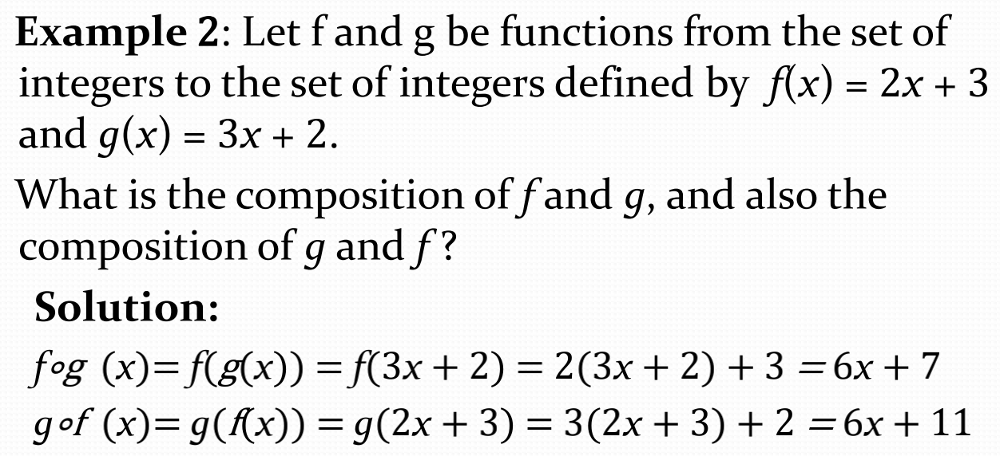
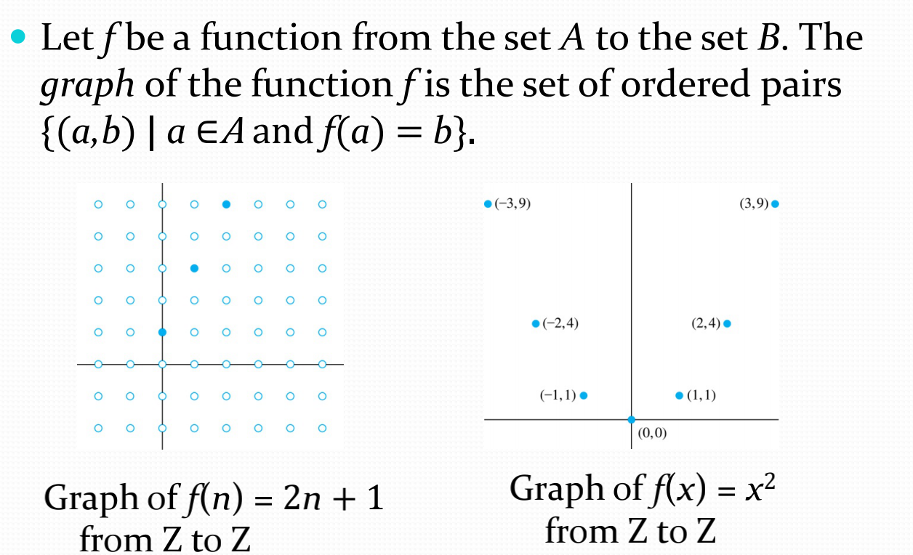
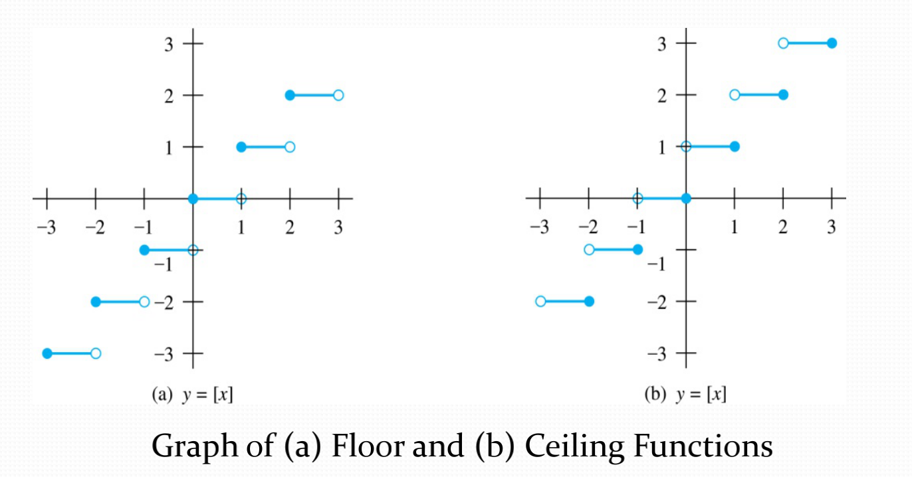
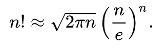
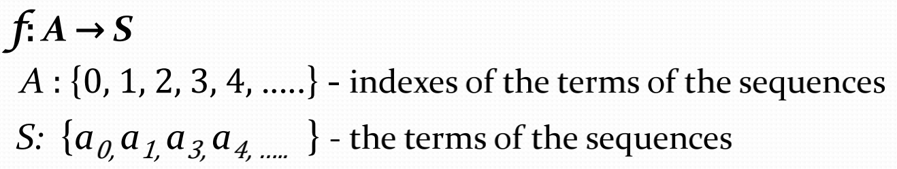
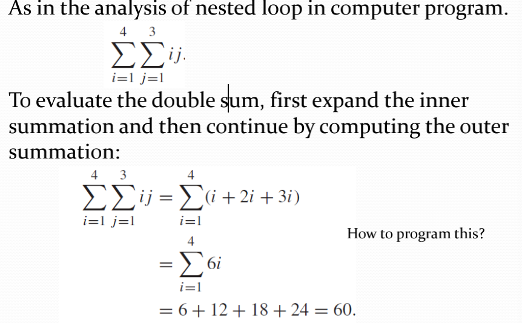

# Function & Sequences and Summmations

- [Function & Sequences and Summmations](#function--sequences-and-summmations)
  - [Composition](#composition)
  - [Ohter Functions](#ohter-functions)
  - [Sequences](#sequences)
  - [Recurrence Relations](#recurrence-relations)
  - [Summations](#summations)
  
## Composition
[复合函数](https://zh.wikipedia.org/wiki/%E5%A4%8D%E5%90%88%E5%87%BD%E6%95%B0)：一个由$(g ∘ f )(x) = g(f(x))$的函数简单说来就是f的值域(the range of $f$)应当是g定义域的子集(a subset of the domain of $g$)的时候才能构成复合函数。
- Example

## Ohter Functions
- Graphs of Functions

- Some Important Functions


  - Floor and Ceiling Functions  
  $\lceil x \rceil$为向上取整，$\lfloor x \rfloor$ 为向下取整
  
  - Factorial Function  
  阶乘要注意0的阶乘为1，另外注意一个[斯特林公式](https://zh.wikipedia.org/wiki/%E5%8F%B2%E7%89%B9%E9%9D%88%E5%85%AC%E5%BC%8F)
  这对复杂度相关计算很有帮助。

## Sequences
简单来说就是数列，只不过用函数的形式来定义



- Example:Geometric Progression, Arithmetic Progression, Strings
  - Geometric Progression(几何级数)  
  也可以叫做等比数列, `initial term` a and the common `ratio` r
  , 比如说$ar^5$就是数列的第6项


  - Arithmetic Progression(算术级数)  
  也可叫做等差数列 with the initial term a and the common `difference`

  - Strings  
  空串用$\lambda$来表示


## Recurrence Relations
对递归来说重要的是找到递归函数(Recurrence function)
同时也必须包含递归基(Initial Conditions)
另外求解递归的方法通常有Forward substitution或Backward substitution。
- Example: Fibonacci Sequence  
斐波拉契数列递推方程为$f_n = f_{n-1} + f_{n-2}$

其在二分查找的分法上很有用处，一种查找的实现方式就是以0.618为界限。
## Summations
$\sum$就是求和符号，上面为上界，下面为初始化的下界，右边为表达式
- Double Summations

```cpp
int main() {
    int sum = 0;
    for (int i = 1; i <= 4; i++) {
        for (int j = 1; j <= 3; j++) {
            sum += i * j;
        }
    }
}
```