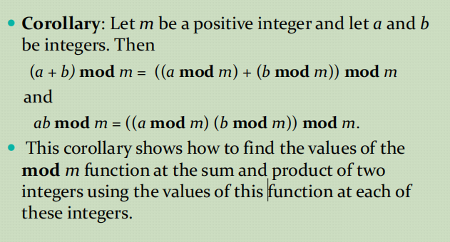
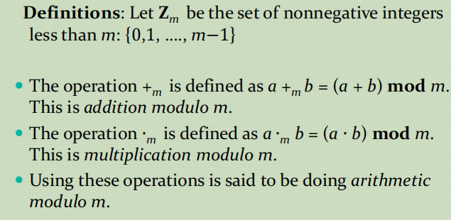
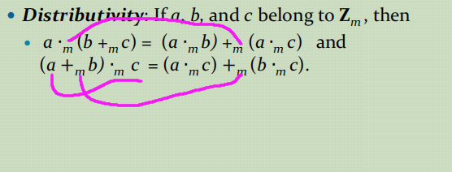

# Number Theory

- [Number Theory](#number-theory)
  - [Computing the mod m Function of Products and Sums](#computing-the-mod-m-function-of-products-and-sums)
  - [Arithmetic Modulo m](#arithmetic-modulo-m)
  - [Integer Representations](#integer-representations)
  - [Base Conversion Algorithm](#base-conversion-algorithm)
  - [Algorithms for Integer Operations](#algorithms-for-integer-operations)

## Computing the mod m Function of Products and Sums

看情况将右边的化为左边或者将左边化为右边

## Arithmetic Modulo m

注意的是这里的Zm这个集合是小于m的数

## Integer Representations
进制的表示。。。
## Base Conversion Algorithm
进制的转换。。。

## Algorithms for Integer Operations

