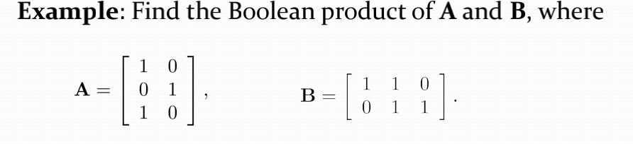
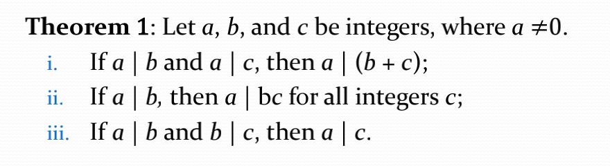
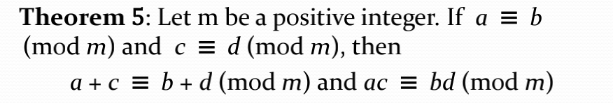
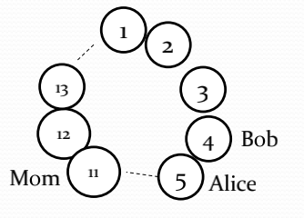

# Matrix & Number Theory

- [Matrix & Number Theory](#matrix--number-theory)
  - [Definition of a Matrix](#definition-of-a-matrix)
  - [Matrix Arithmetic](#matrix-arithmetic)
  - [Transposes and Powers of Arithmetic](#transposes-and-powers-of-arithmetic)
  - [Zero-One matrices](#zero-one-matrices)
  - [Divison](#divison)
  - [Division Algorithm](#division-algorithm)
  - [Modular Arithmetic](#modular-arithmetic)

## Definition of a Matrix
矩阵就是一个m行n列的表格。行列的个数相同的矩阵叫做方阵(square)

## Matrix Arithmetic
线性代数的知识，略过。

## Transposes and Powers of Arithmetic
方阵的幂(Powers of square matrices) $A^0 = I_n\;\;A^r = AA...AA\;$共r个A 

- (Symmetric)对称矩阵  
  如果对square matrix来说，$a_{ij} = a_{ji}$，那么就是Symetric，在经过transpose(转置)之后并不改变

## Zero-One matrices
这个矩阵的所有项都为0或者1
- Joins and Meets of Zero-One Matrices
  Joins(or操作) Meets(and操作)
  
- Boolean Product of Zero-One Matrices
  
  
  总结来说就是对应的乘法位置变成meets操作，加法变成joins操作。
- Boolean Powers of Zero-One Matrices
  
  布尔矩阵的布尔幂计算同布尔矩阵的乘法。

- Identity Matrix
  单位矩阵无论是左乘还是右乘都是得到与之相乘的矩阵

## Divison
如果a能够整除b，那么 a `divides` b. And a is a `factor` or `divisor` of b and that b is a `multiple` of a, 记作a | b，如果不能被整除则a ∤ b.
- Properties of Divisibility
  
  
## Division Algorithm
 a = dq + r 这样一个式子: a就是dividend(被除数), d就是divisor(除数), q就是quotient(商), r就是remainder(余数) q = a **div** d $\;\;$ r = a **mod** d 

 需要注意的是余数不能为负数
## Modular Arithmetic
$a \equiv b(mod\; m)$ 如果m能divides a-b则成立。

其中 这个表达式为congruence(同余) $\equiv$ 为 congruent， m就是模量
如果这个表达式不成立则记作a ≢ b
(mod m)

  
这个等式告诉了我们一些关系。。。 同时这个同余的两边可以同加或者同乘(同除是不行的)
- Example  
  
  关于两个孩子找妈妈 ，一共有13个循环座位，妈妈在第11个座位。孩子b在第4个座位每次前进5个座位。孩子a在第5个座位，每次前进6个位置

  孩子b$\;\;\;4 + 5 * n \equiv 11 (mod\; 13)$

  同时减去4 $\;\;5*n \equiv 7(mod\; 13)$

  孩子a$\;\;\;5 + 6 * n \equiv 11 (mod\; 13)$

  同时减去5 $\;\;6*n \equiv 6(mod\; 13)$

