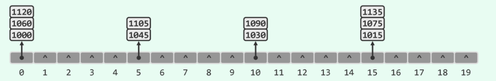

# 关于散列冲突的平方测探方法及数学证明

- [关于散列冲突的平方测探方法及数学证明](#关于散列冲突的平方测探方法及数学证明)
  - [散列冲突](#散列冲突)
  - [查找链的组织方式](#查找链的组织方式)
    - [线性试探](#线性试探)
    - [平方试探](#平方试探)
    - [双向平方试探](#双向平方试探)

## 散列冲突

散列冲突的排解又分为封闭定址(开散列)和开放定址(闭散列)。
  - 封闭定址

>指的是各个桶只能注定存放在特定的词条上。拿独立链作为例子：
  
在这个独立链上，当我们要插入一个数时，用散列函数计算便能够得知会将其插入在哪一个桶上面。
这样的方法需要引入次级关联结构，实现相关算法的复杂度和出错率都会增加，同时因为不能保证物理上的关联性，对于稍大规模的词条集，查找过程会做更多的**I/O**操作
  - 开放定址

>指的是每个桶的存放词条不定，也就是说散列的地址空间对所有的词条都是开放的。从设计上讲就是仅使用基本的散列结构而不引入新的附加空间，我们就是只在这个大数组块上进行操作，因此装填因子需要适度降低，通常取$\lambda \leqslant 0.5$.

## 查找链的组织方式
使用开放地址策略，散列表的每一组相互冲突的词条都被视作有序序列，因此发生冲突时我们就会采取不同的试探策略来检测下一个桶是否被占用。这种查找链具有局部性，可充分利用系统缓存，有效的减少**I/O**。
### 线性试探
>发生冲突时,一个一个地向右边进行查找试探,直到发现一个为空的桶为止.但因为是一个一个地线性试探，以往的冲突会导致后续的冲突。

### 平方试探
>以平方数为距离，确定下一试探桶单元.这样一定程度上会破坏数据的连续性，比如在涉及外存的时候，就会导致I/O的剧增.这种情况是很极端的，通常情况下一个缓存页面在1kb左右，我们每一个桶只需容纳一个指针4字节，也就是说我们有256个桶。这样看来如果要发生I/O剧增我们需要之前连续遇到16次冲突(这种可能性是很小的).问题是**这种试探不一定会将空桶全部发现。**

**事实上，若表长$M$为素数，试探$n^2 \% M$的可能取值恰好为$\lceil M / 2 \rceil$, 这时查找链的前$\lceil M / 2 \rceil$项被遍历**
下面给出证明  
> 假设存在$0 \le a < b < \lceil M/2 \rceil$使得沿查找链的第a项和第b项冲突。  
> 于是$a^2 \equiv b^2 (mod \; M) $  
>  $b^2 - a^2 = (b+a)*(b-a) \equiv 0 (mod \; M)$  
> 然而($0 < b - a < b + a < M$)——这与M为素数项冲突
> 因此假设不成立。
### 双向平方试探
> 发生冲突时，交替地以$n^2$向前向后试探，并且我们让取满足**4K+3的素数作为表长**，这样就必然可以保证查找链的前M项互异。如果不是以这样的素数作为表长，就会出现重复，考察M = 5的情况 结果为{1, 4, 0, 1, 4}明显发生了重复。  

下面给出为什么取4K+3的素数而4k+1的素数就不行。

- 双平方定理

`任一素数p可表示为一对整数的平方和，当且仅当p % 4 = 1` 素数2可能是特殊情况吧

借助$(u^2 + v^2)*(s^2 + t^2) = (us +vt)^2 + (ut-vs)^2$这一等式即可将双平方定理推广至更一般的情况  
`任一自然数n可表示为一对整数的平方和，当且仅当在其素分解中，形如M = 4k + 3的每一素因子均为偶数次方`
对自然数的素分解中，因为我们只需要考虑4k+3的素数为偶数次方时可将其直接代入进4K+1的素数中形成新的4k+3的素数。给出一个例子  
$810 = 2 * 3 * 5 = （1^2 + 1^2) * 9^2 * (1^2 + 1^2)  
=（1^2 + 1^2) *(9^2 + 19^2) = 27^2 + 9^2$这个式子中正是因为3这个素数为偶数次方所以可以进行化简。  
非常好！我们拥有以上的数学工具后就可以开始证明了  
仍然是反证法
首先假设M = 4k + 3时 逆向试探b, 正向试探a会发生冲突
